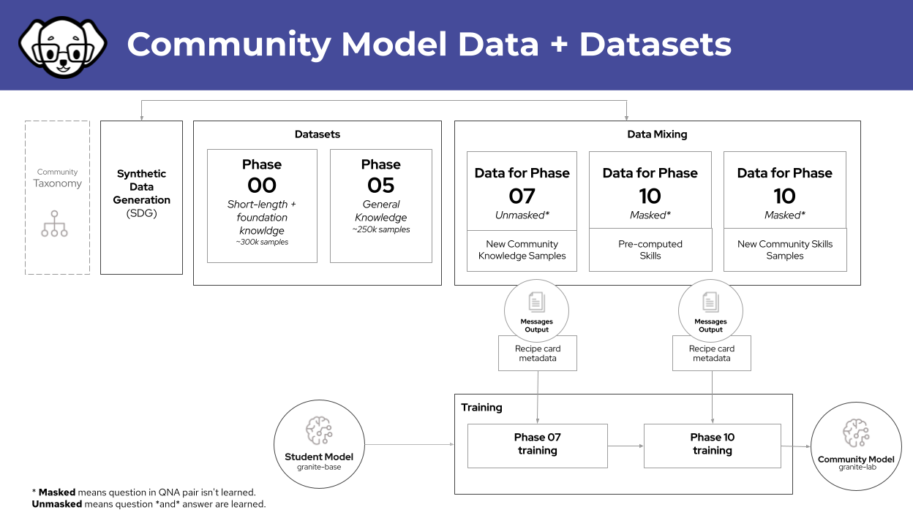

!!! note
    本文档是社区构建流程，这些是构建 cmb 的一般步骤。
    如果你正在寻找适用于 `granite-3.0-8b-base` 的 [config.yaml](https://gist.github.com/jjasghar/436931fbee1d34f029f3c099311301c3)，它在这里。


## 社区模型构建流程图



我们创建了一个默认的 `build.sh` 脚本，它将存放在一个代码仓库中（即将推出）。这里解释了具体的命令，这应该被视为真实来源。

## 将 PR 添加到构建机器的分类树中

将你想要构建的 [PR](https://github.com/instructlab/taxonomy/pulls) 添加到运行中。用 "cmb-running" 标记这些 PR。

示例:
```bash
mkdir -p compositional_skills/general/synonyms
vi compositional_skills/general/synonyms/attribution.txt
vi compositional_skills/general/synonyms/qna.yaml
```
或者如果你从 GitHub 拉取:
```bash
cd ~/.local/share/instructlab/taxonomy
git fetch origin pull/ID/head:BRANCH_NAME
git checkout BRANCHNAME
```

## Verify changes
```bash
ilab taxonomy diff
```

!!! warning
    `~/.local/share/instructlab/datasets` -- 在开始之前应该是空的
     每个 gpu 都应该是"空的"，或者用 `nvidia-smi` 检查显示 `0%`

!!! note
    这些步骤是在团队于 2024 年 12 月 3 日获得的 8 卡 `a100` 机器上测试的。如果你使用不同的硬件，你需要不同的配置文件和不同的选项。

## 重置构建目录

移动或保存旧的构建目录。类似这样的操作:
```bash
mv /home/instructlab/.local/share/instructlab/phased/journalfile.yaml /home/instructlab/.local/share/instructlab/phased/journalfile.yaml_$DATE
mv /home/instructlab/.local/share/instructlab/datasets /home/instructlab/.local/share/instructlab/datasets_$DATE
mv /home/instructlab/.local/share/instructlab/phased /home/instructlab/.local/share/instructlab/phased_$DATE
```

创建你刚才移走的目录:
```bash
mkdir /home/instructlab/.local/share/instructlab/phased
mkdir /home/instructlab/.local/share/instructlab/datasets
```

## 添加 `instructlab_community` mixin
对于基于 `base` 模型的社区构建，你应该添加社区数据集，步骤如下:
```bash
cd ~/.local/share/instructlab/datasets/
wget https://huggingface.co/datasets/instructlab/InstructLabCommunity/resolve/main/instructlab_community.jsonl
cd ~
```
## Modify your config
`ilab config edit`

找到配置文件的 general 部分并确保它与以下内容匹配:

```yaml
general:
  # Debug level for logging.
  # Default: 0
  debug_level: 0
  # Log format. https://docs.python.org/3/library/logging.html#logrecord-attributes
  # Default: %(levelname)s %(asctime)s %(name)s:%(lineno)d: %(message)s
  log_format: '%(levelname)s %(asctime)s %(name)s:%(lineno)d: %(message)s'
  # Log level for logging.
  # Default: INFO
  log_level: INFO
  # Use legacy IBM Granite chat template (default uses 3.0 Instruct template)
  # Default: False
  use_legacy_tmpl: true 
```

use_legacy_tmpl 必须设置为 true 以便为 granite-3.0-8b-base 模型生成数据并进行训练
## 创建数据
```bash
# 宣布 SDG 开始
ilab data generate --pipeline full --gpus 8
# 宣布 SDG 完成
```

## 生成数据完成后运行训练
```bash
# 宣布训练开始
ilab model train --strategy lab-multiphase --phased-phase1-data /home/instructlab/.local/share/instructlab/datasets/knowledge_train_msgs_*.jsonl --phased-phase2-data /home/instructlab/.local/share/instructlab/datasets/skills_train_msgs_*.jsonl --skip-user-confirm --force-clear-phased-cache
# 宣布训练完成
```

## (可选) 训练后评估步骤

如果你想进行完整性检查，可以设置这两个变量来执行训练的子集:
```bash
export INSTRUCTLAB_EVAL_FIRST_N_QUESTIONS=10 # mtbench
export INSTRUCTLAB_EVAL_MMLU_MIN_TASKS=true # mmlu
```

(在需要对特定样本模型创建进行完整性检查的情况下)
```bash
ilab model evaluate --benchmark mt_bench --model ~/.local/share/instructlab/checkpoints/hf_format/samples_XXXXXX
```
!!! tip
    我们应该进行重新评估，因为我们想在进一步操作之前重新验证数据。

## 通用基准测试

- `mmlu`: 通用模型知识，一般事实，这是一个满分为 100 的知识分数
- `mt_bench`: 是一个基于技能的测试，包括提取等能力，满分为 10

!!! note
    对于模型候选者，我们希望 `mt_bench` 平均分数在 7.1 左右

## 特定基准测试
`mmlu_branch`: 这些是针对一般知识的测试

```bash
ilab model evaluate --benchmark mmlu_branch --model ~/.local/share/checkpoints/hf_format/<checkpoint> --tasks-dir ~/.local/share/instructlab/datasets/<node-dataset> --base-model ~/.cache/instructlab/models/granite-7b-redhat-lab
```

`mt_bench_branch`: 这些是针对技能的测试
```bash
ilab model evaluate --benchmark mt_bench_branch --model ~/.local/share/checkpoints/hf_format/<checkpoint> --taxonomy-path ~/.local/share/instructlab/taxonomy --judge-model ~/.cache/instructlab/models/prometheus-8x7b-v2-0 --base-model ~/.cache/instructlab/models/granite-7b-redhat-lab --base-branch main --branch main
```

## 发布到 Huggingface

检查模型以确保它按预期工作:
```bash
ilab model chat --model /home/instructlab/.local/share/instructlab/phased/phase2/checkpoints/hf_format/samples_XXXXX
```

将检查点复制到仓库目录:
```bash
cp /home/instructlab/.local/share/instructlab/phased/phase2/checkpoints/hf_format/samples_XXXX/* ~/huggingface_repos/granite-3.0-8b-lab-community/
```

添加并提交对仓库的更改:
```bash
cd ~/huggingface_repos/granite-3.0-8b-lab-community/
git add .
git commit -s
git push origin main
```

恭喜，这些是构建 safe-tensors 并发布到 hugging face 的核心步骤。
