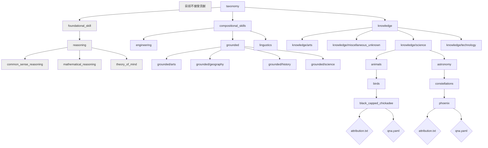

## 欢迎来到 InstructLab 分类系统

InstructLab 🐶 使用一种新颖的基于合成数据的对齐调优方法来训练大语言模型 (LLM)。Instruct**Lab** 🐶 中的 "**lab**" 代表 [**L**arge-Scale **A**lignment for Chat**B**ots](https://arxiv.org/abs/2403.01081) [1]。

LAB 方法由分类系统驱动，这些分类系统主要是经过精心手动创建的。

这个仓库包含一个分类树，允许你使用 LAB 🐶 方法创建用你的数据 (通过合成数据生成增强) 调优的模型。

[1] Shivchander Sudalairaj*, Abhishek Bhandwaldar*, Aldo Pareja*, Kai Xu, David D. Cox, Akash Srivastava*. "LAB: Large-Scale Alignment for ChatBots", arXiv preprint arXiv: 2403.01081, 2024. (* 表示贡献相同)

## 为分类系统选择领域

通常，我们使用杜威十进制分类法 (DDC) 系统来确定我们分类系统中的领域 (和子领域)。这份 [DDC 概要文档](https://www.oclc.org/content/dam/oclc/dewey/resources/summaries/deweysummaries.pdf) 是确定主题分类位置的绝佳资源。

如果你不确定将你的知识或组合技能放在哪里，请在 `knowledge` 或 `compositional_skills` 文件夹下的 `miscellaneous_unknown` 文件夹中创建一个文件夹。

## 学习

在我们的 [InstructLab 社区学习指南](https://github.com/instructlab/community/blob/main/docs/README.md) 中了解"技能"和"知识"的概念。

## 分类树布局

分类树以级联目录结构组织。在每个分支的末端，都有一个 YAML 文件 (qna.yaml)，其中包含该领域的示例。维护者可以决定更改现有分支的名称或添加新分支。

!!! important
    文件夹名称中不包含空格。在单词之间使用下划线。

## 分类图

!!! note
    这些图表显示了分类系统的一个子集。这不是完整的表示。



下面是一个说明性的目录结构，用于展示这种布局：

```ascii
.
└── linguistics
    ├── writing
    │   ├── brainstorming
    │   │   ├── idea_generation
    |   │       └── qna.yaml
    │   │           attribution.txt
    │   │   ├── refute_claim
    |   │       └── qna.yaml
    │   │           attribution.txt
    │   ├── prose
    │   │   ├── articles
    │   │       └── qna.yaml
    │   │           attribution.txt
    └── grammar
        └── qna.yaml
        │   attribution.txt
        └── spelling
            └── qna.yaml
                attribution.txt
```

## 向分类系统贡献知识和技能

为大语言模型 (LLM) 做出贡献一直很困难，很大程度上是因为很难获得必要的计算基础设施。

这个分类仓库将用作 InstructLab 训练模型的合成训练数据的种子。我们计划定期使用主分支按照 InstructLab 的渐进式训练方法重新训练模型。这使得模型能够快速迭代，从而使开源社区受益。

通过向这个仓库贡献你的技能和知识，你将在贡献后的几天内就能看到你的更改被构建到大语言模型中，而不是几个月或几年！如果你在使用模型时发现它的知识或能力有所欠缺，你可以通过贡献知识或技能来纠正它，并在你的更改被构建后检查是否有所改进。

虽然我们欢迎公共贡献以推动社区进步，但你也可以在 [Apache License, Version 2.0](LICENSE) 下分叉这个仓库，添加你自己的内部技能，并在内部训练你自己的模型。但是，你可能需要自己获取足够的计算基础设施来进行充分的重新训练。

## 贡献方式

你可以通过以下两种方式向分类系统贡献：

1. 向**现有叶节点**添加新示例：
2. 为现有领域添加**新分支/技能**：

更多信息，请参见 [向分类仓库贡献的方式](https://github.com/instructlab/taxonomy/blob/main/CONTRIBUTING.md#ways-of-contributing-to-the-taxonomy-repository) 文档。

## 如何贡献技能和知识

要向这个仓库贡献，你将使用许多开源仓库中常见的*分叉和拉取*模型。你可以通过多种方式向分类系统添加技能和知识；有关如何做出贡献的更多信息，请参见 [贡献文档](CONTRIBUTING.md)。你也可以使用以下指南来帮助贡献：

- 使用 [GitHub 网页界面](docs/contributing_via_GH_UI.md) 贡献。
- 在 [知识贡献指南](docs/knowledge-contribution-guide.md) 中向分类系统贡献知识。

### 为什么我要贡献？

这个分类仓库将用作 InstructLab 训练模型的合成训练数据的种子。我们计划尽可能频繁地 (至少每周) 使用主分支重新训练模型。
模型的快速迭代使开源社区受益，并使没有必要计算基础设施的模型开发者能够参与其中。
