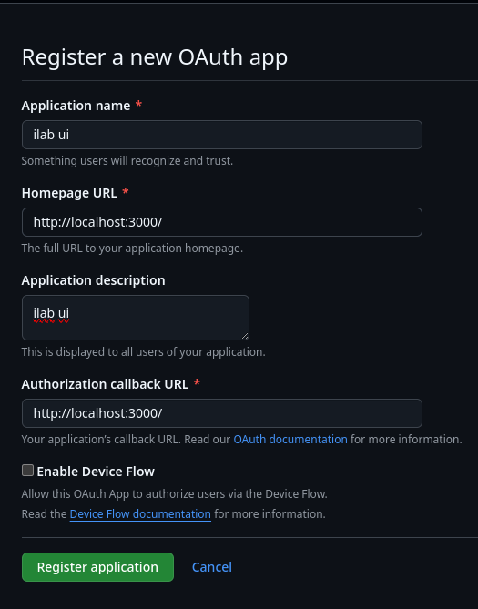

本章专门介绍本地运行用户界面的设置。

## .env

```bash
IL_UI_ADMIN_USERNAME=admin
IL_UI_ADMIN_PASSWORD=password
IL_UI_DEPLOYMENT=dev

OAUTH_GITHUB_ID=<OAUTH_APP_ID>
OAUTH_GITHUB_SECRET=<OAUTH_APP_SECRET>

NEXTAUTH_SECRET=your_super_secret_random_string
NEXTAUTH_URL=http://localhost:3000

IL_GRANITE_API=<GRANITE_HOST>
IL_GRANITE_MODEL_NAME=<GRANITE_MODEL_NAME>
IL_MERLINITE_API=<MERLINITE_HOST>
IL_MERLINITE_MODEL_NAME=<MERLINITE_MODEL_NAME>

GITHUB_TOKEN=<TOKEN FOR OAUTH INSTRUCTLAB MEMBER LOOKUP>
TAXONOMY_DOCUMENTS_REPO=github.com/instructlab-public/taxonomy-knowledge-docs
NEXT_PUBLIC_AUTHENTICATION_ORG=<AUTHENTICATION_ORG>
NEXT_PUBLIC_TAXONOMY_REPO_OWNER=<GITHUB_ACCOUNT>
NEXT_PUBLIC_TAXONOMY_REPO=<REPO_NAME>
```

## OAuth 

要为 UI 设置 GitHub OAuth 设置，请参考以下步骤

`Github settings` -> `Developer settings` -> `OAuth Apps` -> `Create New OAuth App` 

按如下所示填写字段：



将 `Homepage URL` 和 `Authorization Callback URL` 设置为 `http://localhost:3000`。

创建应用程序后，会有一个创建密钥的选项。点击 Create Secret 按钮，它会为你生成一个密钥。

使用生成的新 ID 和密钥 ID 更新 .env 文件，`OAUTH_GITHUB_ID` = Client ID，`OAUTH_GITHUB_SECRET` = Client Secret

!!! note 
    如果你不想设置 OAuth，我们建议你在我们的 `#ui` [Discord 服务器](https://instructlab.ai/discord) 或 [Slack 频道](https://join.slack.com/t/instruct-lab/shared_invite/zt-2kieyqiz9-zhXSxGnXk6uL_f3hVbD53g) 中联系 UI 维护者，他们将提供为 instructlab-public 组织设置 OAuth 应用程序的详细信息。
