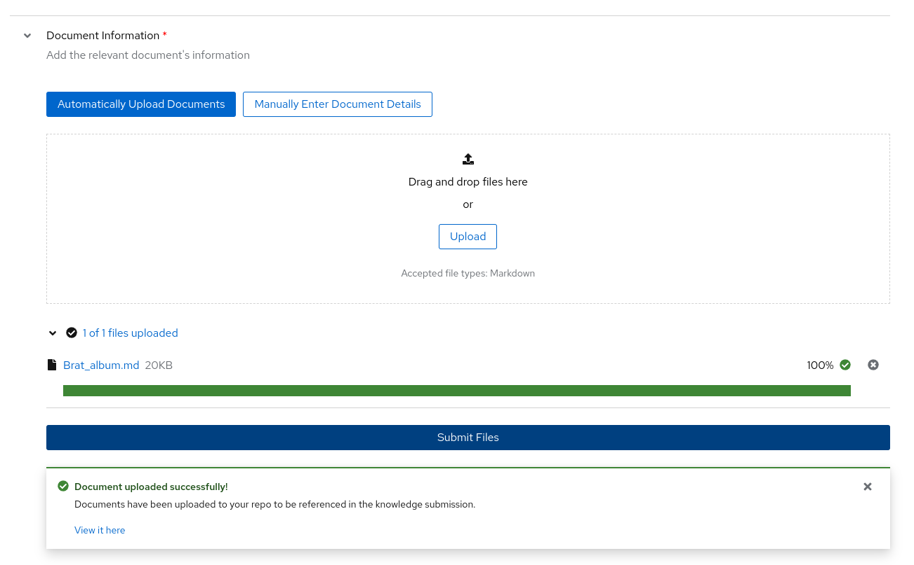
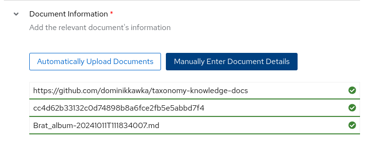

UI 通过以下方式简化了技能和知识贡献的过程：

* 使用网页表单来最小化编写 YAML 时的人为错误风险。

* 只需按一下按钮即可直接提交 GitHub 拉取请求。

填写表单时，你还可以选择将 YAML 和归属文件下载到本地计算机，并在提交前查看表单的原始 YAML 结构。

你可以在仪表板页面查看你的所有提交。

!!! warning
    即使在本地运行 UI，你也必须通过 GitHub 登录才能成功提交你的知识和技能贡献。你仍然可以填写表单，并下载 YAML 和归属文件。

有关编写技能和知识贡献的提示，请访问 [分类系统](/taxonomy/) 标题下的文档。

## 知识贡献

首先，你需要为你的知识找到一个源文档。可以在[这里](/taxonomy/knowledge/guide)找到可接受的来源。

导航到侧边栏的 Contribute 部分，点击 Knowledge。在这里你会看到向开源分类树贡献知识的表单。

### 作者信息

在这里使用你的 GitHub 账户电子邮件地址和全名。这将确保这个贡献和相关数据被正确签署并归功于你。

### 知识信息

在提交摘要框中，简要描述你的知识内容。这将在你提交后用于 PR 描述。在下面，你将填写你要添加的知识所属的领域。例如，如果你想教模型 2024 年奥运会的获胜者，你可能会把"奥运历史"作为领域。

!!! note 
    任务领域是 SDG 过程的关键部分，在生成合成数据时将作为提示的一部分。问问自己："什么样的教科书会包含我试图教给模型的知识？"

知识信息中的最后一个框将包含文档的大纲。

### 分类目录路径

使用下拉菜单，你可以选择你认为你的知识在分类树中最适合的位置。

!!! note 
    在分类树中的正确放置将使其他用户能够更准确地定位现有的叶节点。问问自己："我期望在图书馆的哪个部分找到我的技能？"

### 种子示例

在这里，你将开始填写代表你试图教授的知识的 QNA 示例。这部分必须恰好有 5 个种子示例。每个种子示例需要从你的源文档中选取一个不超过 500 个字符的独特上下文片段。从这个上下文片段中，你需要创建 3 个可以从你选择的上下文中回答的 QNA 对。

### 文档信息

你必须准备一个要用于知识提交的文档的 markdown 文件版本。通过将 markdown 文件拖放到框中，并点击提交文件按钮，将在你的 GitHub 个人资料上自动创建分类仓库的分叉版本。

如果你已经将 markdown 文件上传到你的 GitHub，你可以切换到手动添加文档，并输入 `commit sha`。

!!! note 
    你的知识文档必须放在公开的 GitHub 仓库中才能被接受。当你的提交被审查和合并时，这个文档需要公开可访问。

### 归属信息

链接你用于信息的来源。维基百科文章会随时间变化，确保添加维基百科文章的 oid，你可以通过点击 `View history` 并选择相关版本来找到它。

维基百科文章的许可证将是 "CC-BY-SA-4.0"，创作者名称可以简单写为 "Wikipedia Authors"。

## 仪表板

提交技能或知识贡献后，你可以在仪表板上查看它，并在需要时通过 UI 编辑提交。

[下一步](/user-interface/skills_contributions/){: .md-button .md-button--primary }