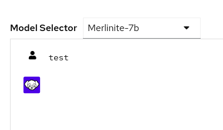
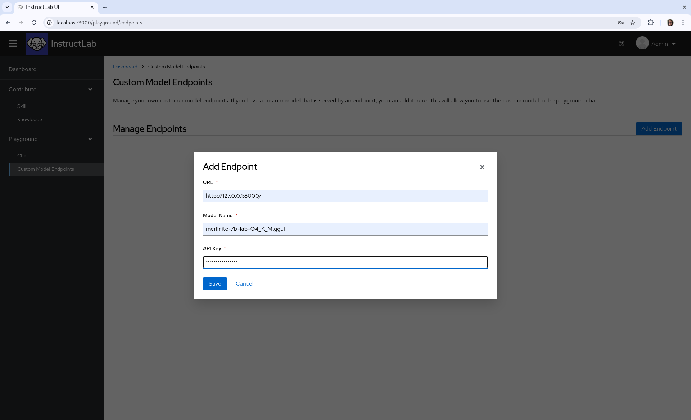
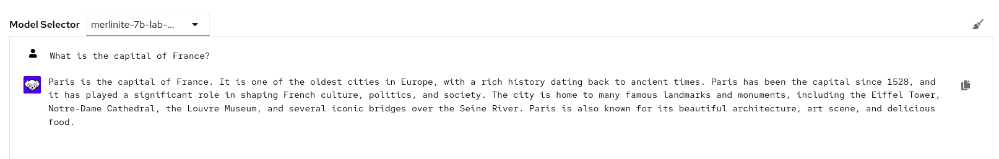

要与本地运行的模型一起使用，请确保在另一个终端中运行 iLab model serve。如果你不确定如何操作，请访问本文档的 [服务和对话入门](/getting-started/serve_and_chat/) 部分。

如果你使用侧边导航栏进入 `Playground > Chat`，你可以与 merlinite 和 granite 模型进行交互。

如果你在开发环境中运行 UI，由于没有提供 granite/merinite 模型端点，模型不会回复。在这种情况下，我们将使用本地托管的量化模型创建一个新的自定义模型端点。

要添加自定义模型端点，请转到 `Playground > Custom Model Endpoints` 并点击右侧的 `Add Endpoint` 按钮。

你需要填写 3 个字段：

* URL，你的自定义模型托管的位置，如果在本地托管，URL 应为 `http://127.0.0.1:8000/`

* 模型名称，`merlinite-7b-lab-Q4_K_M.gguf`

* API 密钥，你可以在这里输入任何文本；在这种情况下，我使用了 `randomCharacters`。如果你正在设置 API 密钥，请在此部分提供密钥。

返回 playground 聊天，选择新添加的模型并开始对话。

[下一步](/user-interface/knowledge_contributions/){: .md-button .md-button--primary }
