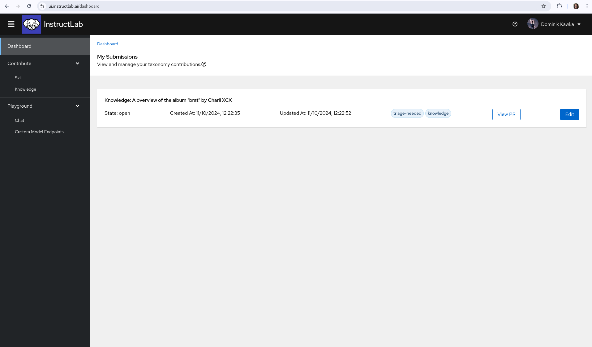

UI 通过以下方式简化了技能和知识贡献的过程：

* 使用网页表单来最小化编写 YAML 时的人为错误风险。

* 只需按一下按钮即可直接提交 GitHub 拉取请求。

填写表单时，你还可以选择将 YAML 和归属文件下载到本地计算机，并在提交前查看表单的原始 YAML 结构。

你可以在仪表板页面查看你的所有提交。

!!! warning
    即使在本地运行 UI，你也必须通过 GitHub 登录才能成功提交你的知识和技能贡献。你仍然可以填写表单，并下载 YAML 和归属文件。

有关编写技能和知识贡献的提示，请访问 [分类系统](/taxonomy/) 标题下的文档。

## 技能贡献

如果你在 granite 聊天中发现缺少某个技能，你可以通过 UI 轻松创建技能贡献。请记住，在 InstructLab GitHub 中可以找到帮助你了解什么是技能的指南。

导航到侧边栏的 Contribute 部分，点击 Skill。在这里你会看到向开源分类树贡献技能的表单。

在这个页面上，你会找到创建技能贡献所需的所有必要部分，让我们在[这里](/taxonomy/skills/skills_guide)逐一了解。

### 作者信息

在这里使用你的 GitHub 账户电子邮件地址和全名。这将确保这个贡献和相关数据被正确签署并归功于你。

### 技能信息

在提交摘要框中，简要描述你的技能是什么。这将在你提交后用于 PR 描述。在下面，你将填写你的技能教导模型做什么的详细描述。例如，如果你的技能是从豆子计数账本中提取日期，你应该填写"教导模型从豆子计数账本中提取日期"。

!!! note 
    详细描述对于高质量的合成数据生成非常重要。你在这个框中填写的内容将在 SDG 过程中用作提示。想象你在告诉教师模型："任务是（你的描述在这里）"。

### 分类目录路径

使用下拉菜单，你可以选择你认为你的技能在分类树中最适合的位置。如果你的技能是有基础的技能（意味着它需要上下文来回答），你需要在选择适当的子部分之前导航到分类树的"grounded"部分。否则，选择你认为最能代表你的技能主题的部分。

!!! note 
    在分类树中的正确放置将使其他用户能够更准确地定位现有的叶节点。问问自己："我期望在图书馆的哪个部分找到我的技能？"

### 种子示例

在这里，你将开始填写代表你试图教授的技能的 QNA 示例。你需要至少 5 个种子示例，每个示例由一个问题和答案组成。如果你的技能是有基础的技能并且需要上下文，你还需要在这里为每个 QNA 对添加上下文。

!!! note 
    你在这里创建的 QNA 对应该是多样化的。你应该尝试用不同的方式重新表述问题并创建独特的上下文。例如，在从豆子计数中提取日期的情况下，你不想在你的种子示例中重复使用相同的日期，因为这可能会产生意想不到的后果，即教导模型在被问到任何日期提取问题时简单地重复相同的日期。

### 归属

在此部分填写的信息将创建提交所需的 attribution.txt 文件。为你的技能填写一个简洁的标题。如果你的技能完全是自己创作的，你可以把你的名字作为创作者，并使用 Apache-2.0 作为许可证。否则，请参考你的源材料获取创作者和许可信息。

一旦你填写了所有必要的信息，你就可以最终提交你的技能了！如果你想下载或查看 qna.yaml 或 attribution.txt，这两个文件都提供了下拉菜单。如果你愿意，你可以下载这些文件，自己在分类仓库中创建 PR。否则，你可以按提交，UI 将在 InstructLab 分类仓库中自动在你的 GitHub 命名空间下创建一个 PR。

## 仪表板

提交技能或知识贡献后，你可以在仪表板上查看它，并在需要时通过 UI 编辑提交。

[下一步](/user-interface/env_oauth_config/){: .md-button .md-button--primary }
