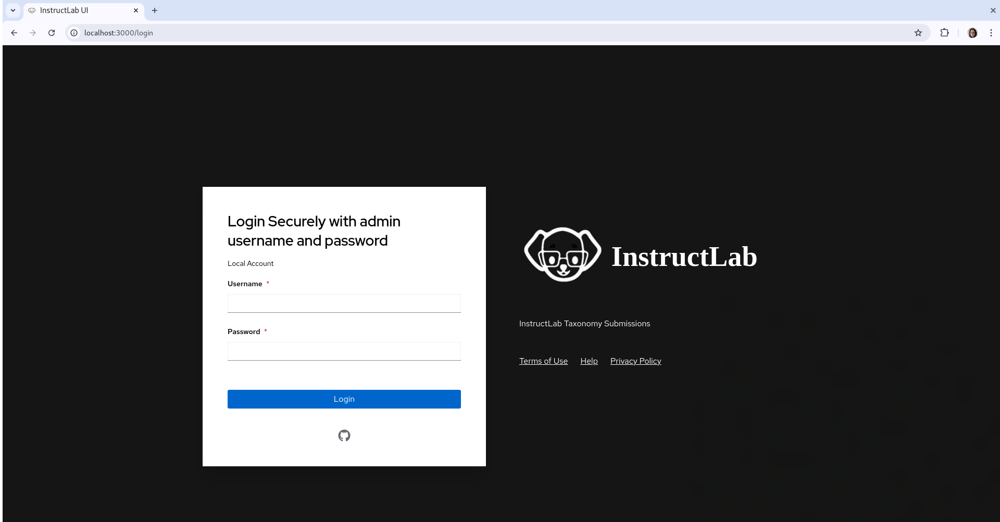

InstructLab 用户界面 (UI) 是 InstructLab 项目的一个附加组件，旨在使知识/技能贡献对普通用户更加易于访问。用户无需编辑 `qna.yaml` 文件，而是可以在网页上填写贡献表单。用户还可以在一个集中的列表中查看他们的所有贡献。你还可以在 playground 中直接与模型对话。

访问 UI 有两种方式：

1. 访问网站 [ui.instructlab.ai](https://ui.instructlab.ai/)。

2. 在本地安装和运行 UI。


!!! note
    要登录 UI 并提交知识和技能贡献，你必须是 [instructlab-public](https://github.com/instructlab-public) GitHub 仓库的成员。

!!! note
    如果你不是仓库成员，但仍想体验 UI，我们建议你在我们的 `#ui` [Discord 服务器](https://instructlab.ai/discord) 或 [Slack 频道](https://join.slack.com/t/instruct-lab/shared_invite/zt-2kieyqiz9-zhXSxGnXk6uL_f3hVbD53g) 中联系 UI 维护者获取邀请。
    
    如果你不想加入但仍想体验，可以在本地下载。

## 先决条件

在本地运行用户界面之前，你必须：

* 拥有一个 [GitHub](https://github.com/) 账户

* 安装 Node.js

!!! warning
    本指南是基于 `Node.js v20.17.0` 编写的。如果你使用的是较旧版本的 Node.js，请注意应用程序可能无法按预期工作。

## 安装指南

1) 在你想要的目录中运行以下命令下载 InstructLab UI：

`git clone https://github.com/instructlab/ui`

你也可以访问 [InstructLab UI GitHub 页面](https://github.com/instructlab/ui)，点击代码，然后点击下载按钮进行下载。

2) 设置 .env 文件。运行以下命令进入 UI 文件夹：

`cd ui`

在 UI 文件夹中，创建一个名为 `.env` 的新文件，并在其中粘贴以下内容：

```bash
IL_UI_ADMIN_USERNAME=admin
IL_UI_ADMIN_PASSWORD=password
IL_UI_DEPLOYMENT=dev

OAUTH_GITHUB_ID=<OAUTH_APP_ID>
OAUTH_GITHUB_SECRET=<OAUTH_APP_SECRET>

NEXTAUTH_SECRET=your_super_secret_random_string
NEXTAUTH_URL=http://localhost:3000

IL_GRANITE_API=<GRANITE_HOST>
IL_GRANITE_MODEL_NAME=<GRANITE_MODEL_NAME>
IL_MERLINITE_API=<MERLINITE_HOST>
IL_MERLINITE_MODEL_NAME=<MERLINITE_MODEL_NAME>

GITHUB_TOKEN=<TOKEN FOR OAUTH INSTRUCTLAB MEMBER LOOKUP>
TAXONOMY_DOCUMENTS_REPO=github.com/instructlab-public/taxonomy-knowledge-docs
NEXT_PUBLIC_AUTHENTICATION_ORG=<AUTHENTICATION_ORG>
NEXT_PUBLIC_TAXONOMY_REPO_OWNER=<GITHUB_ACCOUNT>
NEXT_PUBLIC_TAXONOMY_REPO=<REPO_NAME>
```

目前，我们只关注 `IL_UI_ADMIN_USERNAME`、`IL_UI_ADMIN_PASSWORD` 和 `IL_UI_DEPLOYMENT`。但在本 UI 指南中，我们会经常访问 .env 文件。

__保存并关闭 .env 文件。__

3) 运行 Node 命令进行安装和运行。

回到 UI 文件夹中，运行以下命令安装 UI 运行所需的文件：

`npm install`

!!! note
    根据你的网络速度和连接情况，这个过程可能需要几分钟。

安装完成后，运行以下命令启动 UI：

`make start-dev-local`

UI 现在应该已经启动并运行，你可以在浏览器中输入 `localhost:3000` 访问它，它应该会带你到登录界面。



你可以随时运行以下命令停止 UI：

`make stop-dev-local`

4) 登录

现在，我们将在用户名和密码字段中分别输入 `admin` 和 `password` 进行登录。你可以通过编辑 .env 文件中的 `IL_UI_ADMIN_USERNAME` 和 `IL_UI_ADMIN_PASSWORD` 值来更改用户名和密码。

由于我们还没有在 .env 文件中设置 GitHub token，所以现在无法使用 GitHub 登录。登录后，你可能会看到一个弹出窗口，说 UI 正在获取你的提交，退出这个通知。如果你想设置 OAuth，请访问 [.env 和 OAuth 配置页面](/user-interface/env_oauth_config/)。

[下一步](/user-interface/playground_chat/){: .md-button .md-button--primary }
